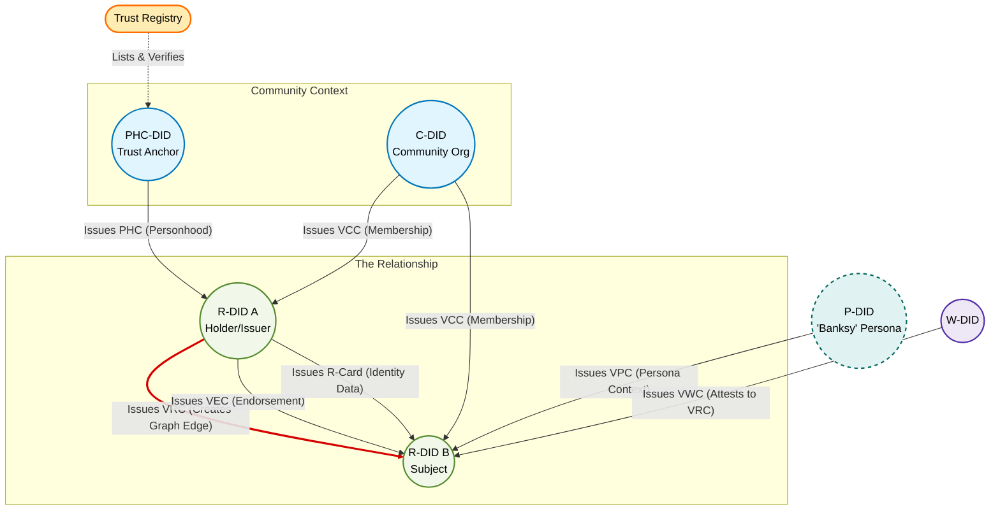

# Decentralized Trust Graph Credentials (Early Draft, v0.2)

## Abstract

This document specifies a unified schema for seven subtypes of W3C Verifiable Credentials used in the Decentralized Trust Graph (DTG). These credentials allow for privacy-preserving zero-knowledge proofs (ZKPs) of personhood, community membership, and facts about relationships from the perspective of the entities involved.

1.  **Community Credential** (VCC): Establishes membership in a community defined by a Community DID (C-DID).
2.  **Personhood Credential** (PHC): A specialized VCC issued by a C-DID listed in a trust registry (PHC-DID) to establish verified personhood.
3.  **Relationship Credential** (VRC): Establishes a directional relationship edge between two entities within the same community context.
4.  **Persona Credential** (VPC): Enables an entity to share a specific persona/context without creating a new DTG edge.
5.  **Endorsement Credential** (VEC): Endorses another entity for skills or accomplishments.
6.  **Witness Credential** (VWC): Attests to the establishment of a Relationship Credential from the perspective of a Witness DID (W-DID).
7.  **Relationship Card** (R-Card): A human-readable identity presentation (JCard) akin to a business card.

## Terminology

**_Decentralized Trust Graph (DTG)_**
A structure where nodes are entities and edges are verified relationships.

**_DTG Credential_**
The abstract base class for all credentials in this specification. All other credential types are sub-classes of this base class.

**_C-DID (Community DID)_**
A typically public DID representing a community, organization, DAO, or group. C-DIDs act as the issuer for Community Credentials (VCCs).

**_PHC-DID_**
A specific subset of C-DIDs that are listed in a publicly verifiable trust registry. They are authorized to issue Personhood Credentials.

**_R-DID (Relationship DID)_**
A pairwise private and unique DID used to establish a unique node context or graph edge.

**_P-DID (Persona DID)_**
A DID representing a context-specific persona, shared via VPCs.

**_W-DID (Witness DID)_**
A DID representing an witness to a VRC. Might also be an R-DID, P-DID, C-DID or PHC-DID.

**_Community Credential (VCC)_**
A credential issued by a C-DID to an R-DID, establishing the R-DID as a member node within that community's subgraph.

**_Personhood Credential (PHC)_**
A specialized VCC where the issuer is a PHC-DID, establishing verified personhood.

**_Relationship Credential (VRC)_**
A credential creating a directional edge between two R-DIDs that exist within the same community (hold VCCs from the same C-DID).

## Credential Type Hierarchy

All credentials inherit from the abstract `DTGCredential`.

```text
VerifiableCredential (W3C Standard)
└── DTGCredential
    ├── CommunityCredential (VCC)
    ├── PersonhoodCredential (PHC)
    ├── RelationshipCredential (VRC)
    ├── PersonaCredential (VPC)
    ├── EndorsementCredential (VEC)
    ├── WitnessCredential (VWC)
    └── RCardCredential (R-Card)
```

## Diagram: The Credential Flow & Trust Graph



### How to read this diagram:

1.  **The Foundation (Top):**
    *   The **Registry** lists high-trust issuers (PHC-DIDs).
    *   **C-DIDs** (Community DIDs) and **PHC-DIDs** issue the initial credentials (**VCC** or **PHC**) to users. This establishes the users as nodes (R-DIDs) within that specific graph.

2.  **The Core Graph Edge (Red Arrow):**
    *   Once **Alice** and **Bob** are both members of the community (holding VCCs), Alice can issue a **VRC** (Relationship Credential) to Bob.
    *   This is the primary "Edge" in the Decentralized Trust Graph.

3.  **Data Exchange (Middle):**
    *   Now that the relationship exists, Alice can attach data to it.
    *   **VEC:** She endorses Bob for a skill.
    *   **R-Card:** She sends Bob her business card details.

4.  **Advanced Context (Sides):**
    *   **Persona (VPC):** Alice (acting as her persona "Banksy") sends a VPC to Bob. This tells Bob, "The person you have a relationship with is also Banksy," without creating a separate graph entry for Banksy.
    *   **Witness (VWC):** A third party (Watcher) sees the relationship between Alice and Bob and issues a credential attesting that it happened.

## Unified Credential Schema

All types share an abstract base schema, distinguished using the `type` array.

### Core Structure

```json
{
  "@context": [
    "https://www.w3.org/ns/credentials/v2",
    "https://firstperson.network/credentials/dtg/v1"
  ],
  "type": [
    "VerifiableCredential",
    "DTGCredential",
    "RelationshipCredential"
  ],
  "issuer": "did:example:issuerDid",
  "validFrom": "2024-06-18T10:00:00Z",
  "credentialSubject": {
    "id": "did:example:subjectDid"
  },
  "proof": {
    "type": "Ed25519Signature2020",
    "proofValue": "..."
  }
}
```

### Property Definitions

#### For all credential subtypes
*   **type** (`array`): MUST include `VerifiableCredential`, `DTGCredential`, and the specific subtype(s).
*   **issuer** (`string`): The DID of the entity issuing the credential.
*   **validFrom** (`string`): The date and time the credential becomes valid, in ISO 8601 format.
*   **validUntil** (`string`, optional):The date and time the credential expires, in ISO 8601 format.

#### For specific credential subtypes
*   **credentialSubject.endorsement** (`object`): (VEC only) Details of the endorsement.
*   **credentialSubject.card** (`array`): (R-Card only) JCard data.
*   **credentialSubject.witnessContext** (`object`): (VWC only) Describes the witnessing parameters.
    *   **event** (`string`): Human-readable name of the event or location (e.g., "Class 101", "Conference 2025").
    *   **sessionId** (`string`): The challenge/nonce used in the wrapping protocol.
    *   **method** (`string`): The verification method (e.g., "visual", "digital-handshake", "sas-verification").

### Credential Type Comparison

| Property | VCC | PHC | VRC | VPC | VEC | VWC | R-Card |
| :--- | :--- | :--- | :--- | :--- | :--- | :--- | :--- |
| **Issuer** | **C-DID** | **PHC-DID** | R-DID | P-DID | R-DID | W-DID | R-DID |
| **Subject ID** | R-DID | R-DID | R-DID | R-DID | R-DID | R-DID | R-DID |
| **DTG Edge?** | Node Entry | Node Entry | Yes | No | No | No | No |

## VCC: Community Credential

The VCC represents the "entry ticket" into a specific community or graph. It establishes an initial node for the holder within that C-DID's namespace.

*   **type**: MUST include `"CommunityCredential"`.
*   **issuer**: MUST be a **C-DID** (Community DID).
*   **credentialSubject.id**: An R-DID used solely for membership in this community.

**Example:** A local chess club (C-DID) issues a VCC to a member.

```json
{
  "type": ["VerifiableCredential", "DTGCredential", "CommunityCredential"],
  "issuer": "did:example:chessClubCdid",
  "credentialSubject": { "id": "did:example:memberRDid" }
  // ... proof
}
```

## PHC: Personhood Credential

A specialized VCC where the C-DID is a high-assurance, registered trust anchor.

*   **type**: MUST include `"PersonhoodCredential"`.
*   **issuer**: MUST be a **PHC-DID** (a C-DID listed in a publicly verifiable trust registry).
*   **Validation**: Verifiers check the issuer against the registry.

**Example:** Government Agency Issues PHC.

```json
{
  "type": ["VerifiableCredential", "DTGCredential",  "PersonhoodCredential"],
  "issuer": "did:example:governmentAgencyPhcDid",
  "credentialSubject": { "id": "did:example:citizenRDid" }
  // ... proof
}
```

## VRC: Relationship Credential

Creates a directional edge between two entities within the same community (defined by a common C-DID).

*   **type**: MUST include `"RelationshipCredential"`.
*   **Prerequisite**: Both Issuer and Subject MUST hold a VCC (or PHC) from the same C-DID.
*   **issuer/subject**: SHOULD be the R-DIDs used in the parent VCC/PHC.

#### Unilateral Relationship Identification
A Relationship DID (R-DID) generated by a controller for the explicit purpose of establishing a Relationship Credential (VRC) serves as a globally unique identifier for that relationship edge from the perspective of the controller.

Therefore, a relationship within the DTG can be canonically identified by two independent identifiers:

* The Source R-DID (controlled by the Issuer).
* The Target R-DID (controlled by the Subject).

Semantic statements, metadata, or private context regarding the relationship MAY be anchored solely to the controller's own R-DID, without requiring the resolution or inclusion of the counterparty's identifier.

**Important**: The valid application of this specification requires that each entity must generate a new, unique R-DID for every single entity he/she/it connects with, even within the same community.

**Example:** Alice issues VRC to Bob (both are members of the same Community).

```json
{
  "type": ["VerifiableCredential", "DTGCredential", "RelationshipCredential"],
  "issuer": "did:example:aliceVrcRDid",
  "credentialSubject": { "id": "did:example:bobVrcRDid" }
  // ... proof
}
```

**ZK Proof Logic:**
To prove a relationship, the holder proves:
1.  Possession of the VRC.
2.  Possession of the underlying VCC/PHC (proving membership in C-DID).
3.  The VRC Issuer possesses a VCC/PHC from the *same* C-DID.

## VPC: Persona Credential

Allows an entity to share a persona (P-DID) with another entity they already have a relationship with, without creating a new graph edge.

*   **type**: MUST include `"PersonaCredential"`.
*   **issuer**: A P-DID (the persona).
*   **credentialSubject.id**: The R-DID used in the existing VRC with the recipient.

**Example:** "Banksy" shares a VPC with a trusted friend.

```json
{
  "type": ["VerifiableCredential", "DTGCredential", "PersonaCredential"],
  "issuer": "did:example:banksyArtistPersona",
  "credentialSubject": { "id": "did:example:friendVrcRDid" }
  // ... proof
}
```

## VEC: Endorsement Credential

Endorses an entity for skills or accomplishments. Does not create a graph edge.

*   **type**: MUST include `"EndorsementCredential"`.
*   **credentialSubject.endorsement**: Object describing the skill/claim.

**Example:** Alice endorses Bob.

```json
{
  "type": ["VerifiableCredential", "DTGCredential", "EndorsementCredential"],
  "issuer": "did:example:aliceVrcRDid",
  "credentialSubject": {
    "id": "did:example:bobVrcRDid",
    "endorsement": {
      "type": "SkillEndorsement",
      "name": "Software Development",
      "competencyLevel": "expert"
    }
  }
}
```

## VWC: Witness Credential

A third party attests to the establishment of a VRC. It effectively "locks in" the verification that occurred during a specific session.

*   **type**: MUST include `"WitnessCredential"`.
*   **issuer**: The Witness DID.
*   **credentialSubject.id**: MUST match the Subject of the witnessed VRC.
*   **credentialSubject.digest** (Optional): A cryptographic hash of the witnessed VRC (to prevent reuse).
*   **credentialSubject.witnessContext** (Optional): An object describing the session, event, or conditions under which the witnessing occurred.

**Example:** Witness attests to a relationship formed at EthDenver 2024.

```json
{
  "type": ["VerifiableCredential", "DTGCredential", "WitnessCredential"],
  "issuer": "did:example:witnessBot",
  "credentialSubject": {
    "id": "did:example:bobVrcRDid",

    // NEW: Cryptographic binding to the specific target VRC
    "digest": "sha256:e3b0c44298fc1c149afbf4c8996fb92427ae41e4649b934ca495991b7852b855",

    // NEW: Semantic context
    "witnessContext": {
        "event": "EthDenver 2024",
        "sessionId": "session-8822-nonce",
        "method": "in-person-proximity"
    }
  }
}
```

## R-Card: Relationship Card Credential

Provides human-readable identity data (vCard/JCard) within a relationship.

*   **type**: MUST include `"RCardCredential"`.
*   **credentialSubject.card**: Array containing JCard (RFC 7095) data.

**Example:** Alice shares contact info.

```json
{
  "type": ["VerifiableCredential", "DTGCredential", "RCardCredential"],
  "issuer": "did:example:aliceVrcRDid",
  "credentialSubject": {
    "id": "did:example:bobVrcRDid",
    "card": ["vcard", [["fn", {}, "text", "Alice Smith"], ["email", {}, "text", "alice@example.com"]]]
  }
}
```
