# Decentralized Trust Graph Credentials (Early Draft, v0.3)

# DTG Credentials - Core Specification

## 1. Overview

This specification defines six W3C Verifiable Credential types and one Verifiable Data Structure (VDS) for the Decentralized Trust Graph (DTG). These credentials enable **privacy-preserving zero-knowledge proofs (ZKPs)** of personhood, community membership, and facts about relationships from the perspective of the entities involved, while maintaining minimal correlation across contexts.

These credentials and data structures fall into four functional categories:

**Edge Credentials** - Create nodes and relationships in the trust graph:
- **VMC** (Membership Credential) - Establishes a node (membership in a VTC/VTN)
- **VRC** (Relationship Credential) - Creates a directed trust edge between two nodes

**Invitation Credentials** - Bootstrap new members into communities:
- **InvitationCredential** - Authorizes onboarding of a prospective member

**Annotation Credentials** - Attach data to existing edges without creating new graph structure:
- **VPC** (Persona Credential) - Links a persona to a relationship
- **VEC** (Endorsement Credential) - Endorses skills/reputation
- **VWC** (Witness Credential) - Third-party attestation of an edge

**Verifiable Data Structures (VDS)** - Structured data exchange:
- **RCard** (Relationship Card) - Human-readable identity data (like a business card)

> **Important:** These four categories are **descriptive only** and aid understanding. They do not appear in credential schemas. The formal type hierarchy has only one abstract parent: `DTGCredential`.


---

## 2. Visual Taxonomy

```mermaid
graph TB
    subgraph Types["DTG Credential Types (Normative)"]
        direction TB

        subgraph VDS["Verifiable Data Structures"]
            RCARD["RCard<br/><small>Relationship Card</small><br/><i>Contact/identity data</i>"]
        end

        subgraph Annotation["Annotation Credentials"]
            VPC["VPC<br/><small>PersonaCredential</small><br/><i>Links persona to edge</i>"]
            VEC["VEC<br/><small>EndorsementCredential</small><br/><i>Endorses party</i>"]
            VWC["VWC<br/><small>WitnessCredential</small><br/><i>Attests to edge</i>"]
        end

        subgraph Invitation["Invitation Credentials"]
            INV["InvitationCredential<br/><i>Authorizes onboarding</i>"]
        end

        subgraph Edge["Edge Credentials"]
            VMC["VMC<br/><small>MembershipCredential</small><br/><i>Creates membership node</i>"]
            VRC["VRC<br/><small>RelationshipCredential</small><br/><i>Creates directed edge</i>"]
        end
    end

    subgraph Legend[" "]
        direction LR
        L1["🔵 Edge Credentials<br/><i>Create graph structure</i>"]
        L2["🟠 Invitation Credentials<br/><i>Bootstrap membership</i>"]
        L3["🟣 Annotation Credentials<br/><i>Attach to existing edges</i>"]
        L4["🟢 Verifiable Data Structures<br/><i>Data exchange</i>"]
    end

    classDef edge fill:#bbdefb,stroke:#1976d2,stroke-width:2px,color:#000
    classDef inv fill:#ffe0b2,stroke:#f57c00,stroke-width:2px,color:#000
    classDef ann fill:#e1bee7,stroke:#7b1fa2,stroke-width:2px,color:#000
    classDef vds fill:#c8e6c9,stroke:#388e3c,stroke-width:2px,color:#000
    classDef legend fill:#f5f5f5,stroke:#666,stroke-width:1px,color:#000

    class VMC,VRC edge
    class INV inv
    class VPC,VEC,VWC ann
    class RCARD vds
    class L1,L2,L3,L4 legend
```



#### Formal W3C Type Hierarchy:

```
VerifiableCredential
└── DTGCredential
    ├── MembershipCredential (VMC)
    ├── RelationshipCredential (VRC)
    ├── InvitationCredential (VIC)
    ├── PersonaCredential (VPC)
    ├── EndorsementCredential (VEC)
    ├── WitnessCredential (VWC)
    └── RelationshipCard (RCard) [VDS - not a credential]
```

## 3. W3C Verifiable Credentials Version Support

### Primary Standard: v2.0

This specification is written using **W3C Verifiable Credentials Data Model v2.0** syntax. All DTG implementations MUST support v2.0 credential verification and SHOULD support v2.0 credential issuance.

### Legacy System Compatibility: v1.1

Many existing identity verification providers, trust registries, and community infrastructure may only support W3C VC Data Model v1.1. To ensure broad interoperability and avoid forcing costly system migrations:

- DTG implementations **SHOULD** accept and verify v1.1 credentials
- Existing credential issuers **MAY** issue DTG-compliant credentials using v1.1 syntax
- New implementations **SHOULD** prioritize v2.0 but **MAY** also issue v1.1 when required by ecosystem constraints

> **Design Intent:** This dual-version support enables:
> - Legacy IDVPs to issue VMCs (personhood credentials) without system upgrades
> - Existing VTCs to participate in the DTG using their current infrastructure
> - Gradual ecosystem migration from v1.1 to v2.0 without breaking trust relationships

### Property Mapping

The only differences between v1.1 and v2.0 DTG credentials are:

| Property | v1.1 | v2.0 |
|----------|------|------|
| **Context** | `https://www.w3.org/2018/credentials/v1` | `https://www.w3.org/ns/credentials/v2` |
| **Issuance** | `issuanceDate` | `validFrom` |
| **Expiration** | `expirationDate` | `validUntil` |

All DTG-specific schemas (types, issuer requirements, credentialSubject structure) are identical.

> **Implementation Note:** Verifiers supporting both v1.1 and v2.0 credentials MUST be able to process proof types commonly used in both versions. Issuers SHOULD use well-supported proof types and include all necessary contexts.

### Dual-Version Examples

**v2.0 (Primary):**
```jsonc
{
  "@context": [
    "https://www.w3.org/ns/credentials/v2",
    "https://firstperson.network/credentials/dtg/v1",
    "https://w3id.org/security/suites/ed25519-2020/v1"
  ],
  "type": ["VerifiableCredential", "DTGCredential", "MembershipCredential"],
  "issuer": "did:web:chess-club.example",
  "validFrom": "2026-01-06T10:00:00Z",
  "validUntil": "2027-01-06T10:00:00Z",
  "credentialSubject": {
    "id": "did:key:z6MkpTHR8VNs..."
  },
  "proof": {
    "type": "Ed25519Signature2020",
    "created": "2026-01-06T10:00:00Z",
    "proofPurpose": "assertionMethod",
    "verificationMethod": "did:web:chess-club.example#key-1",
    "proofValue": "z3FXQjecWJKT..."
  }
}
```

**v1.1 (Legacy Compatibility):**
```jsonc
{
  "@context": [
    "https://www.w3.org/2018/credentials/v1",
    "https://firstperson.network/credentials/dtg/v1",
    "https://w3id.org/security/suites/ed25519-2020/v1"
  ],
  "type": ["VerifiableCredential", "DTGCredential", "MembershipCredential"],
  "issuer": "did:web:chess-club.example",
  "issuanceDate": "2026-01-06T10:00:00Z",
  "expirationDate": "2027-01-06T10:00:00Z",
  "credentialSubject": {
    "id": "did:key:z6MkpTHR8VNs..."
  },
  "proof": {
    "type": "Ed25519Signature2020",
    "created": "2026-01-06T10:00:00Z",
    "proofPurpose": "assertionMethod",
    "verificationMethod": "did:web:chess-club.example#key-1",
    "proofValue": "z3FXQjecWJKT..."
  }
}
```

> **Note:** All examples in this specification use v2.0 syntax unless explicitly labeled otherwise. When implementing v1.1 support, use the property mappings above.


---

## 4. Base Structure

All DTG credentials share this W3C VC structure (v2.0 shown; see §2 for v1.1 compatibility):

**Schema:**
- `@context` (array, REQUIRED): MUST include `"https://www.w3.org/ns/credentials/v2"` and `"https://firstperson.network/credentials/dtg/v1"`, plus any additional contexts required by the proof type
- `type` (array, REQUIRED): MUST include `"VerifiableCredential"`, `"DTGCredential"`, and exactly one concrete subtype
- `issuer` (string, REQUIRED): DID of the issuing entity (C-DID, M-DID, R-DID, or P-DID as appropriate)
- `validFrom` (string, REQUIRED): ISO 8601 datetime (`issuanceDate` in v1.1)
- `validUntil` (string, OPTIONAL): ISO 8601 datetime (`expirationDate` in v1.1)
- `credentialSubject` (object, REQUIRED):
  - `id` (string, REQUIRED): DID of the subject
  - Additional type-specific properties
- `proof` (object, REQUIRED): W3C VC proof object

**Example:**
```jsonc
{
  "@context": [
    "https://www.w3.org/ns/credentials/v2",
    "https://firstperson.network/credentials/dtg/v1",
    "https://w3id.org/security/suites/ed25519-2020/v1"
  ],
  "type": ["VerifiableCredential", "DTGCredential", "MembershipCredential"],
  "issuer": "did:example:vtcCommunityDid",
  "validFrom": "2026-01-06T10:00:00Z",
  "validUntil": "2027-01-06T10:00:00Z",
  "credentialSubject": {
    "id": "did:example:memberMdid"
  },
  "proof": {
    "type": "Ed25519Signature2020",
    "created": "2026-01-06T10:00:00Z",
    "proofPurpose": "assertionMethod",
    "verificationMethod": "did:example:vtcCommunityDid#key-1",
    "proofValue": "z3FXQjecWJKT..."
  }
}
```

---

## 5. Edge Credentials

### 5.1 VMC (Membership Credential)

**Purpose:** Establishes a node in the DTG by defining membership in a VTC or VTN.

**Schema:**
- `type` (array, REQUIRED): MUST include `"MembershipCredential"`
- `issuer` (string, REQUIRED): C-DID of the VTC or VTN
- `credentialSubject` (object, REQUIRED):
  - `id` (string, REQUIRED): M-DID of the member (person/device/agent) OR C-DID (for VTC-to-VTC membership)

**Example:**
```jsonc
{
  "@context": [
    "https://www.w3.org/ns/credentials/v2",
    "https://firstperson.network/credentials/dtg/v1",
    "https://w3id.org/security/suites/ed25519-2020/v1"
  ],
  "type": ["VerifiableCredential", "DTGCredential", "MembershipCredential"],
  "issuer": "did:web:chess-club.example",
  "validFrom": "2026-01-06T10:00:00Z",
  "credentialSubject": {
    "id": "did:key:z6MkpTHR8VNs..."
  },
  "proof": { /* ... */ }
}
```

---

### 5.2 VRC (Relationship Credential)

**Purpose:** Creates a directed trust edge between two nodes. Two VRCs (one each direction) form a complete DTG edge.

**Schema:**
- `type` (array, REQUIRED): MUST include `"RelationshipCredential"`
- `issuer` (string, REQUIRED): R-DID or M-DID of the source party
- `credentialSubject` (object, REQUIRED):
  - `id` (string, REQUIRED): R-DID or M-DID of the target party

**Example:**
```jsonc
{
  "@context": [
    "https://www.w3.org/ns/credentials/v2",
    "https://firstperson.network/credentials/dtg/v1",
    "https://w3id.org/security/suites/ed25519-2020/v1"
  ],
  "type": ["VerifiableCredential", "DTGCredential", "RelationshipCredential"],
  "issuer": "did:peer:2.Ez6LSbysKZ...",
  "validFrom": "2026-01-06T10:00:00Z",
  "credentialSubject": {
    "id": "did:peer:2.Ez6LSpSrLxn..."
  },
  "proof": { /* ... */ }
}
```

**Note:** R-DIDs recommended for privacy; M-DIDs allowed for bootstrapping (see privacy considerations).

#### Unilateral Relationship Identification

A Relationship DID (R-DID) generated by a controller for the explicit purpose of establishing a Relationship Credential (VRC) serves as a globally unique identifier for that relationship edge from the perspective of the controller.

Therefore, a relationship within the DTG can be canonically identified by two independent identifiers:

* The Source R-DID (controlled by the Issuer)
* The Target R-DID (controlled by the Subject)

Semantic statements, metadata, or private context regarding the relationship MAY be anchored solely to the controller's own R-DID, without requiring the resolution or inclusion of the counterparty's identifier.

> **IMPORTANT**: The valid application of this specification requires that each entity MUST generate a new, unique R-DID for every single entity they connect with, even within the same community.

#### Zero-Knowledge Proof Requirements

To prove a relationship using a VRC, the holder proves:
1.  Possession of the VRC
2.  Possession of the underlying VMC (proving membership in the community)
3.  The VRC issuer possesses a VMC from the *same* C-DID

This allows proof of relationship existence without revealing the specific DIDs or other credential details.

---

## 6. Invitation Credentials

### InvitationCredential (VIC)

**Purpose:** Authorizes a prospective member to join a VTC or VTN when presented to the VTA/PEP.

**Schema:**
- `type` (array, REQUIRED): MUST include `"InvitationCredential"`
- `issuer` (string, REQUIRED):
  - For VTC invitation: VTC C-DID OR authorized member's M-DID (per policy)
  - For VTN invitation: VTN C-DID OR member VTC's C-DID (per policy)
- `credentialSubject` (object, REQUIRED):
  - `id` (string, REQUIRED):
    - For VTC invitation: prospective member's M-DID OR prospective VTC's C-DID
    - For VTN invitation: prospective VTC's C-DID

**Example (VTC member invitation):**
```jsonc
{
  "@context": [
    "https://www.w3.org/ns/credentials/v2",
    "https://firstperson.network/credentials/dtg/v1",
    "https://w3id.org/security/suites/ed25519-2020/v1"
  ],
  "type": ["VerifiableCredential", "DTGCredential", "InvitationCredential"],
  "issuer": "did:key:z6MkhaXgBZD...",
  "validFrom": "2026-01-06T10:00:00Z",
  "validUntil": "2026-02-06T10:00:00Z",
  "credentialSubject": {
    "id": "did:key:z6MkpTHR8VNs..."
  },
  "proof": { /* ... */ }
}
```

**Roles and access control** Roles and access control policy details are primarily inferred from issuer + trust registry.
**Q:** Should any of this be embedded in the VIC?

---

## 7. Annotation Credentials

Annotation credentials **do not create graph structure**. They attach data to existing edges or parties.

### 7.1 VPC (Persona Credential)

**Purpose:** Links a persona DID (P-DID) to an existing relationship.

**Schema:**
- `type` (array, REQUIRED): MUST include `"PersonaCredential"`
- `issuer` (string, REQUIRED): P-DID of the persona
- `credentialSubject` (object, REQUIRED):
  - `id` (string, REQUIRED): Counterparty's DID (typically R-DID or M-DID used in the relationship)

**Example:**
```jsonc
{
  "@context": [
    "https://www.w3.org/ns/credentials/v2",
    "https://firstperson.network/credentials/dtg/v1",
    "https://w3id.org/security/suites/ed25519-2020/v1"
  ],
  "type": ["VerifiableCredential", "DTGCredential", "PersonaCredential"],
  "issuer": "did:key:z6MkrKqT9pL...",
  "validFrom": "2026-01-06T10:00:00Z",
  "credentialSubject": {
    "id": "did:peer:2.Ez6LSpSrLxn..."
  },
  "proof": { /* ... */ }
}
```

---

### 7.2 VEC (Endorsement Credential)

**Purpose:** Attaches endorsements (skills, reputation) to a party.

**Schema:**
- `type` (array, REQUIRED): MUST include `"EndorsementCredential"`
- `issuer` (string, REQUIRED): DID of the endorser
- `credentialSubject` (object, REQUIRED):
  - `id` (string, REQUIRED): DID of the endorsed party
  - `endorsement` (object, REQUIRED): Community/VTN-defined endorsement structure
    - Structure and fields determined by community policy

**Example:**
```jsonc
{
  "@context": [
    "https://www.w3.org/ns/credentials/v2",
    "https://firstperson.network/credentials/dtg/v1",
    "https://w3id.org/security/suites/ed25519-2020/v1"
  ],
  "type": ["VerifiableCredential", "DTGCredential", "EndorsementCredential"],
  "issuer": "did:key:z6MkhaXgBZD...",
  "validFrom": "2026-01-06T10:00:00Z",
  "credentialSubject": {
    "id": "did:key:z6MkpTHR8VNs...",
    "endorsement": {
      "type": "SkillEndorsement",
      "name": "Software Development",
      "competencyLevel": "expert"
    }
  },
  "proof": { /* ... */ }
}
```

---

### 7.3 VWC (Witness Credential)

**Purpose:** Third-party attestation that an edge was established under specific conditions.

**Schema:**
- `type` (array, REQUIRED): MUST include `"WitnessCredential"`
- `issuer` (string, REQUIRED): Witness DID (W-DID)
- `credentialSubject` (object, REQUIRED):
  - `id` (string, REQUIRED): DID of the observed party
  - `digest` (string, OPTIONAL): A cryptographic hash of the witnessed VRC. A SHA‑256 hash of the verifiable credential's canonical representation. The hash is encoded as a multibase string (multihash + multibase).
  - `witnessContext` (object, OPTIONAL): Context of the witnessing event
    - `event` (string, OPTIONAL): Human-readable event name
    - `sessionId` (string, OPTIONAL): Session or nonce identifier
    - `method` (string, OPTIONAL): Verification method used

**Example:**
```jsonc
{
  "@context": [
    "https://www.w3.org/ns/credentials/v2",
    "https://firstperson.network/credentials/dtg/v1",
    "https://w3id.org/security/suites/ed25519-2020/v1"
  ],
  "type": ["VerifiableCredential", "DTGCredential", "WitnessCredential"],
  "issuer": "did:web:witness-service.example",
  "validFrom": "2026-01-06T10:00:00Z",
  "credentialSubject": {
    "id": "did:key:z6MkpTHR8VNs...",
    "digest": "sha256:e3b0c44298fc1c149afbf4c8996fb92427ae41e4649b934ca495991b7852b855",
    "witnessContext": {
      "event": "EthDenver 2024",
      "sessionId": "session-abc-123",
      "method": "in-person-proximity"
    }
  },
  "proof": { /* ... */ }
}
```

---

## 8. RCard (Relationship Card) - VDS

**Purpose:** Verifiable data structure containing human-readable identity/contact information, analogous to a business card.

**Status:** RCard is a **VDS**, not a DTGCredential subtype, though it is implemented as a W3C VC.

**Schema (v2.0 shown; see §2 for v1.1 compatibility):**
- `type` (array, REQUIRED): MUST include `"VerifiableCredential"` and `"RelationshipCard"`; does NOT include `"DTGCredential"`
- `issuer` (string, REQUIRED): DID of the card publisher
- `credentialSubject` (object, REQUIRED):
  - `id` (string, REQUIRED): DID of the counterparty
  - `card` (array, REQUIRED): JCard (RFC 7095) formatted data

**Example:**
```jsonc
{
  "@context": [
    "https://www.w3.org/ns/credentials/v2",
    "https://firstperson.network/credentials/dtg/v1",
    "https://w3id.org/security/suites/ed25519-2020/v1"
  ],
  "type": ["VerifiableCredential", "RelationshipCard"],
  "issuer": "did:key:z6MkhaXgBZD...",
  "validFrom": "2026-01-06T10:00:00Z",
  "credentialSubject": {
    "id": "did:key:z6MkpTHR8VNs...",
    "card": ["vcard", [
      ["version", {}, "text", "4.0"],
      ["fn", {}, "text", "Alice Smith"],
      ["email", {}, "text", "alice@example.com"],
      ["tel", {"type": "work"}, "uri", "tel:+1-555-123-4567"]
    ]]
  },
  "proof": { /* ... */ }
}
```

---

## 9. Additional Notes

### Personhood Credentials (PHC)

A **PHC** is simply a **VMC** issued by a VTC whose governance enforces:
- Real human personhood
- Exactly one membership per person

No additional schema fields required. PHC status is determined by governance and trust registries, not by credential structure. Issuers may optionally add `"PersonhoodCredential"` to the `type` array as a non-authoritative hint.

**Example:**
```jsonc
{
  "type": [
    "VerifiableCredential",
    "DTGCredential",
    "MembershipCredential",
    "PersonhoodCredential"
  ],
  "issuer": "did:web:government-idv.example",
  "credentialSubject": {
    "id": "did:key:z6MkpTHR8VNs..."
  }
}
```

### Trust Registries

- **Authoritative source** for roles (initiator, CTA, member, IDVP, trust anchors, etc.)
- Map DIDs to roles and policies
- Determine acceptable issuers
- Schema and APIs out of scope for this spec
- Handles revocations, etc.

### Identity Verification Credentials (IDVC)

- **Not DTGCredential subtypes**
- Any W3C VC satisfying a VTC/VTN's identity-proofing requirements
- Issuers, assurance levels, and requirements governed by VTC/VTN policy and trust registries

### Zero-Knowledge & Selective Disclosure

- Spec is **format-agnostic** (no binding to BBS+, SD-JWT-VC, etc.)
- Schemas kept simple to enable common predicates:
  - "Holder has valid VMC from recognized VTC"
  - "Issuer is authorized member"
  - "Two distinct VRCs exist"
- Detailed ZK protocols and registry-ZK interactions left to future work

### Privacy Considerations

**M-DID reuse:** Allowed for bootstrapping, but implementers should carefully consider correlation risks when reusing M-DIDs across multiple relationships. Migration from M-DID-based to R-DID-based edges recommended post-bootstrapping for enhanced privacy.

---